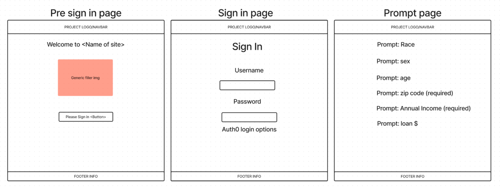
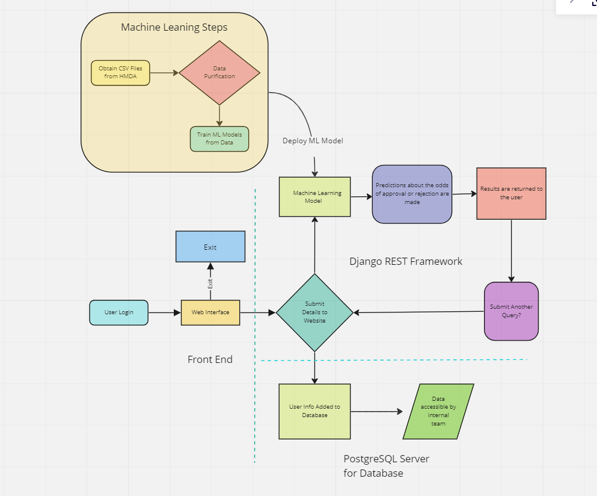
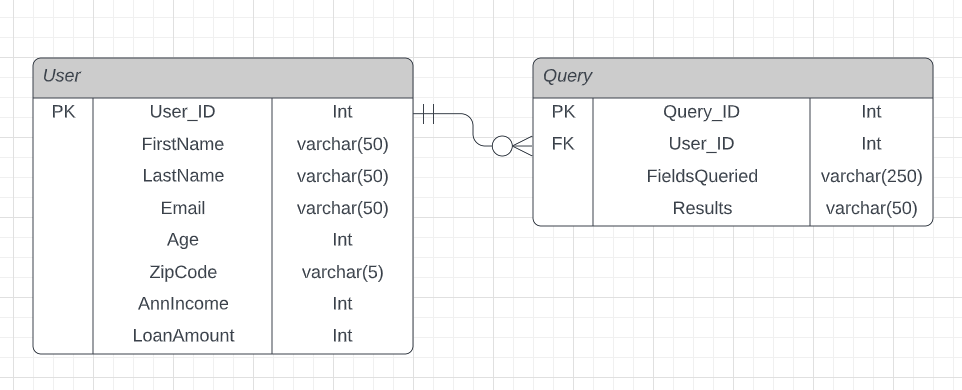

# Final Project 401 Code Fellows

## Group Members
- Domaine Scully
- Keyan Tabor
- Eric Kinuthia
- Brian Sward

### Wireframe
- 

### User Stories
- User Story 1
  - Title: New Agent Inquires for a Prospective Client 
  - User: Real Estate agent you can’t afford to incur the fees commonly associated with researching current sales trends so they can use this low cost option to better service their clients with info regarding the likelihood of approval
  - Feature Tasks: Will return to the user a response indicating the likelihood of approval
  - Acceptance Tests: Take known cases of accepted/rejected and feed those instances into our model with same results being returned the user

- User Story 2
  - Title: Potential Homeowner checking to see their odds of approval without impacting their credit score
  - User: A person looking to see the likelihood of their loan approval based on certain criteria
  - Feature Tasks: Will return to the user a response indicating the likelihood of approval
  - Acceptance Tests: Take known cases of accepted/rejected and feed those instances into our model with same results being returned the user

- User Story 3
  - Title: Borrower(s)/Buyer(s) are able to get instant approval decision 
  - User: Clients are able to obtain instant decision within seconds for a 98 percentage rate of getting pre-approved
  - Feature Tasks: Will return to the user a response indicating the likelihood of approval
  - Acceptance Tests: Given known demographic info about a user the program returns the correct results

- User Story 4 (Stretch Goal)
  - Title: We Take YourData
  - User: Us, the app developer
  - Feature Tasks: We create a database of information based upon end user input which we can be leveraged to provide us trends in our user base
  - Acceptance Tests: Items are successfully added to the database and can be recalled from the database at will

- User Story 5 (Stretch Goal)
  - Title: First time homebuyer down payment assistance varies from state to state, this program, if given the correct information, will return the expected total amount awarded
  - User: A Person looking to buy a new home and are curious of how much assistance they can receive
  - Feature Tasks: User inputs State and Personal Financial Information and receives info based upon these fields
  - Acceptance Tests: Given known demographic info about a user the program returns the correct results

